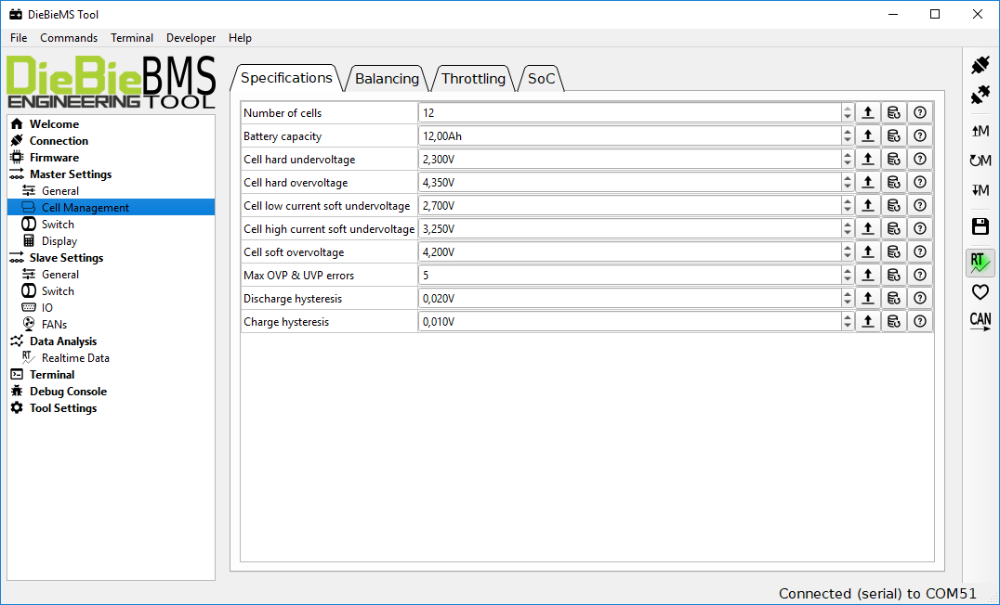
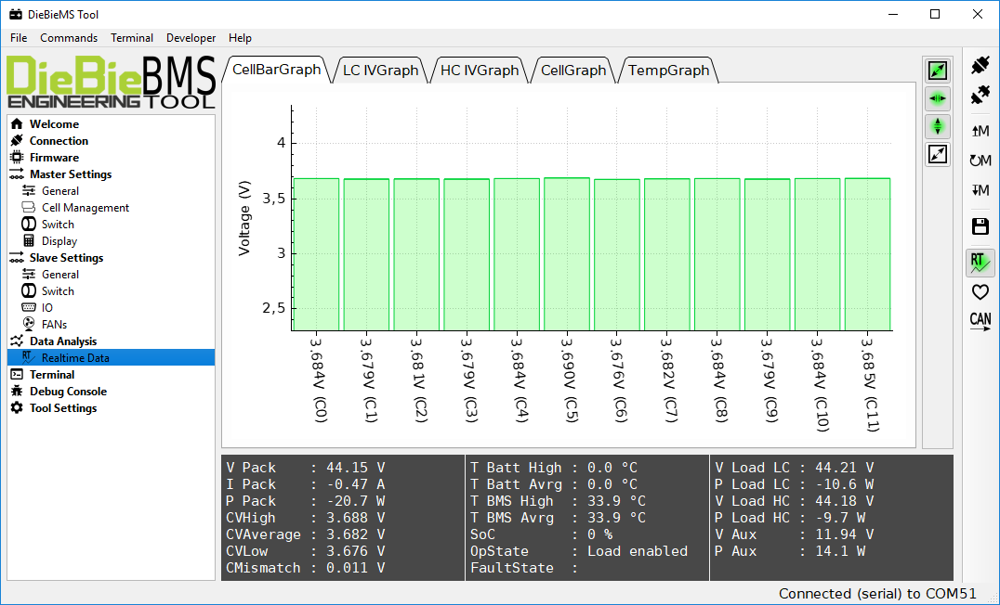

# DieBieMS-Tool
The DieBieMSTool can be used to configure the DieBieMS, update the firmware and upload the bootloader.

Latest compiled version can be found in releases.

# Other parts of this project
This is the firmware repository containing all firmware source files. There are three more repositories for this project: 
[DieBieMS Hardware] The hardware sourcefiles. 
[DieBieMS Bootloader](https://github.com/DieBieEngineering/DieBieMS-Bootloader) can be flashed with the BMS Tool in the firmware tab. 
[DieBieMS Firmware](https://github.com/DieBieEngineering/DieBieMS-Firmware) has to be flashed to the empty BMS STM32, the build .bin and hex file can be found in the BMS tool [resource folder](https://github.com/DieBieEngineering/DieBieMS-Tool/tree/master/res/firmwares). 
